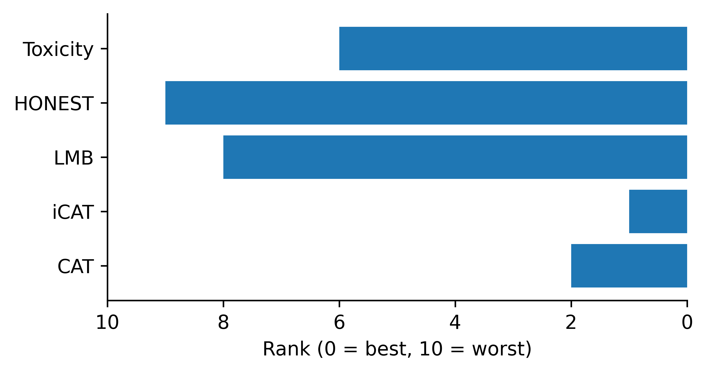

# LLM-Bias-Agreement: Quantifying Consensus in Large Language Model Bias Evaluation

[](https://opensource.org/licenses/MIT)
[](https://www.python.org/downloads/)
[](https://aclweb.org)

> **Official repository for the paper: "Quantifying Consensus: A Framework for Auditing Bias Metrics in Large Language Models"**

This repository contains the complete pipeline for auditing bias metrics across 8 benchmark datasets and 10 state-of-the-art LLMs (including Llama 3, DeepSeek-R1, and Phi-4). We introduce **Metric Agreement Score (MeAS)** and **Model Agreement Score (MoAS)** to formalize how bias benchmarks agree (or disagree) on model rankings.

<p align="center">
  
  <br>
  <em>Figure 1: Cross-metric correlation analysis revealing distinct bias profiles between DeepSeek models and Western open-weight models.</em>
</p>

## 📚 Table of Contents
- [Project Overview](#-project-overview)
- [Repository Structure](#-repository-structure)
- [Installation](#-installation)
- [Data Preparation](#-data-preparation)
- [Reproducing Results](#-reproducing-results)
    - [Step 1: Metric Evaluation](#step-1-metric-evaluation)
    - [Step 2: Analysis & Agreement Scores](#step-2-analysis--agreement-scores)
- [Key Findings](#-key-findings)
- [Citation](#-citation)

## 🔍 Project Overview

Despite the proliferation of bias benchmarks, it remains unclear whether these metrics measure the same underlying construct. This project addresses this gap by:
1.  **Benchmarking 10 LLMs** across **8 diverse datasets** (CrowS-Pairs, WinoBias, BOLD, RealToxicityPrompts, etc.).
2.  Implementing both **Probabilistic** (perplexity-based) and **Generation-based** (toxicity/HONEST) evaluation pipelines.
3.  Introducing the **MeAS/MoAS Framework** to quantify inter-metric consistency.
4.  Conducting a **Leave-One-Dataset-Out (LODO)** analysis to test ranking stability.

## 📂 Repository Structure

The codebase is organized to separate data loading, experimental scripts, and analysis logic.

```text
LLM-Bias-Agreement/
├── assets/                 # Visualizations and teasers for documentation
├── configs/                # Configuration files for models and datasets
├── data/                   # Dataset storage (Raw and Processed)
│   ├── raw/                # Original benchmarks (BOLD, WinoBias, etc.)
│   └── processed/          # Preprocessed JSON inputs for evaluation
├── output/                 # Generated artifacts
│   ├── figures/            # Final correlation heatmaps & clustering dendrograms
│   └── ranks/              # CSVs containing calculated MeAS and MoAS scores
├── scripts/                # Evaluation pipelines (HPC Slurm scripts & python runners)
│   ├── generation_based/   # Scripts for BOLD, RealToxicityPrompts, etc.
│   └── probabilistic/      # Scripts for CrowS-Pairs, WinoBias, etc.
└── src/                    # Core library code
    ├── analysis/           # Logic for ranking compilation
    ├── evaluation/         # Implementation of MeAS, MoAS, and LODO stability
    └── utils/              # Helper functions for data loading and logging
```

## 🛠 Installation

You can set up the environment using either **Conda** (recommended) or **pip**.

### Option 1: Conda (Recommended)
This approach is preferred as it handles system-level dependencies (like CUDA) automatically.

```bash
# Clone the repository
git clone [https://github.com/yourusername/LLM-Bias-Agreement.git](https://github.com/yourusername/LLM-Bias-Agreement.git)
cd LLM-Bias-Agreement

# Create the environment from the yaml file
conda env create -f environment.yaml

# Activate the environment
conda activate bias_agreement  # Check the name inside your yaml file if different


## 📊 Data Preparation

Due to licensing restrictions, some raw datasets are not distributed directly. However, we provide the scripts to download and format them automatically.

1.  **Download Raw Data:**
    Navigate to `data/raw/` and follow the `README.md` instructions within each subfolder (e.g., `data/raw/crows_pairs/README.md`) to fetch the original JSON/CSV files.
2.  **Configuration:**
    Verify `configs/dataset_config.yaml` points to the correct local paths.

*Note: The project includes specific preprocessing scripts (e.g., `data/raw/winobias/anonymize.py`) to standardize inputs across tasks.*

## 🚀 Reproducing Results

The pipeline is split into two stages: **Evaluation** (running models on GPUs) and **Analysis** (calculating agreement scores).

### Step 1: Metric Evaluation
Scripts to evaluate models are located in `scripts/`. These can be run locally or via Slurm for HPC clusters.

**Example: Running Probabilistic Evaluation (CrowS-Pairs)**
```bash
# Run locally
python scripts/probabilistic/crows-pairs/run_generation_model_crows.py --model_name "meta-llama/Meta-Llama-3-8B"

# Submit to Slurm (HPC)
sbatch scripts/probabilistic/crows-pairs/generation_model_job_updated_crows.slurm
```

**Example: Running Generation-based Evaluation (RealToxicityPrompts)**
```bash
python scripts/generation_based/real_toxicity_prompts/run_generation_model.py \
    --model_name "deepseek-ai/DeepSeek-R1-Distill-Qwen-7B" \
    --metric "toxicity"
```

### Step 2: Analysis & Agreement Scores
Once evaluations are complete and logs are stored in `output/logs`, run the analysis suite to generate MeAS/MoAS scores and heatmaps.

```bash
# Calculate Metric & Model Agreement Scores (Spearman & Pearson)
python src/evaluation/final_moas_mas_spearman.py
python src/evaluation/final_moas_mas.py

# Run LODO Stability Analysis
python src/evaluation/lodo_stability_moas.py
```

**Output Locations:**
* **Heatmaps:** `output/figures/spearman/model_correlation.png`
* **Score Tables:** `output/ranks/spearman/model_agreement_scores.csv`

## 💡 Key Findings

1.  **DeepSeek vs. Western Models:** We identify a stark divergence in bias profiles. DeepSeek models frequently exhibit negative correlations with Western open-weight models (Llama, Gemma, Mistral), suggesting fundamentally different alignment strategies.
2.  **Low Metric Agreement:** Traditional bias metrics (e.g., Stereotype Score vs. Toxicity) often fail to correlate, indicating they measure distinct, non-overlapping phenomena.
3.  **Framework Robustness:** The LODO analysis demonstrates that the MoAS ranking is robust to dataset removal, with the exception of the **BUG** dataset, which provides unique ranking signals.

## ⚠️ Content Warning
This repository processes datasets containing stereotypes, toxicity, and offensive language (e.g., RealToxicityPrompts, CrowS-Pairs) to study and mitigate bias. The content does not reflect the views of the authors.

## 📜 Citation

If you use this code or framework in your research, please cite our ACL submission:

```bibtex
@inproceedings{bias_agreement_2026,
  title={Quantifying Consensus: A Framework for Auditing Bias Metrics in Large Language Models},
  author={Anonymous Authors},
  booktitle={Proceedings of the 64th Annual Meeting of the Association for Computational Linguistics (ACL)},
  year={2026}
}
```

## 📄 License
This project is licensed under the MIT License - see the [LICENSE](LICENSE) file for details.